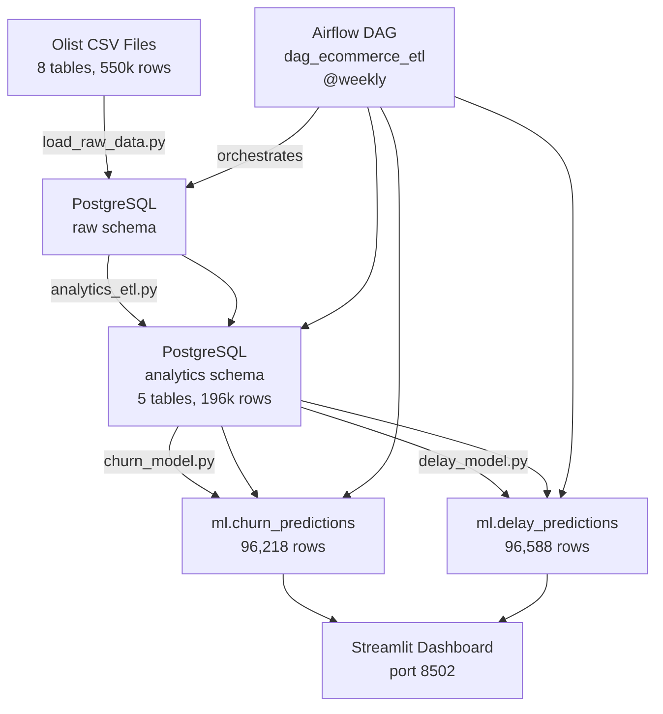

# Capstone Architecture — E-Commerce Analytics Platform

## Dataset
- Source: Olist Brazilian E-Commerce (Kaggle)
- Volume: ~100k orders, 8 tables, 550k total rows
- Period: 2016–2018

## Database Design

### raw schema — direct CSV loads (no transformation)
| Table | Rows | Key Column |
|-------|------|------------|
| orders | 99,441 | order_id |
| order_items | 112,650 | order_id, order_item_id |
| order_payments | 103,886 | order_id |
| order_reviews | 99,224 | review_id |
| customers | 99,441 | customer_id |
| sellers | 3,095 | seller_id |
| products | 32,951 | product_id |
| product_category_translation | 71 | product_category_name |

### analytics schema — derived tables (ETL output)
| Table | Description | Built from |
|-------|-------------|------------|
| customer_ltv | Customer lifetime value + churn flag | orders + payments + customers |
| order_metrics | Delivery time, review score per order | orders + reviews + order_items |
| seller_performance | Revenue, rating, on-time % per seller | order_items + orders + reviews |
| product_analytics | Revenue, volume per category | order_items + products + translation |
| monthly_revenue | Monthly revenue time series + MoM growth | orders + order_payments |

### ml schema — ML outputs
| Table | Description |
|-------|-------------|
| churn_predictions | Customer churn probability |
| delay_predictions | Order delivery delay probability |
| customer_segments | KMeans cluster assignments |

## ML Models
| Model | Target | Features | Algorithm |
|-------|--------|----------|-----------|
| Churn | Has customer ordered again? | LTV, days since last order, review score | RandomForest + SMOTE |
| Delay | Will order be delivered late? | product weight, distance, seller rating | GradientBoosting |

## Pipeline Architecture



## Database Schema

### raw schema (source data — no transforms)
| Table                               | Purpose                                        |
| ----------------------------------- | ---------------------------------------------- |
| `olist_orders_dataset`              | Order status and lifecycle timestamps          |
| `olist_order_items_dataset`         | Products purchased in each order               |
| `olist_order_payments_dataset`      | Payment methods and payment amounts            |
| `olist_order_reviews_dataset`       | Customer ratings and reviews                   |
| `olist_customers_dataset`           | Customer demographic and location information  |
| `olist_sellers_dataset`             | Seller information and geographic distribution |
| `olist_products_dataset`            | Product metadata and dimensions                |
| `product_category_name_translation` | Portuguese-to-English category mapping         |


### analytics schema (business metrics)
| Table | Business Question | Interview Relevance |
|-------|------------------|---------------------|
| `customer_ltv` | Who are our most valuable customers? Will they churn? | LTV is asked in every DE/DS interview |
| `order_metrics` | How fast are we delivering? Are customers happy? | Ops KPI — every e-commerce company tracks this |
| `seller_performance` | Which sellers drive revenue and which hurt ratings? | Marketplace analytics — Amazon, Shopify core |
| `product_analytics` | Which categories generate most revenue? | Inventory/pricing decisions |
| `monthly_revenue` | How is the business growing MoM? | CFO metric — always asked |

### ml schema (model outputs)
[Add prediction table definitions from Day 45]
| Table | Business Question | Interview Relevance |
|-------|------------------|---------------------|
| `ml.churn_predictions` |has ~96k rows | [  ] |
| `ml.delay_predictions` |has ~96k rows | [  ] |


## Design Decisions

| Decision | Choice | Rationale |
|----------|--------|-----------|
| Schema separation | raw/analytics/ml | Clean lineage — each layer has one purpose |
| Payment aggregation | SUM before JOIN | raw.order_payments has multiple rows per order |
| Churn definition | single-purchase = churned | Dataset ends 2018 — time-based definition unreliable |
| Model persistence | ImbPipeline pkl | Scaler + SMOTE config travels with model |
| Airflow schedule | @weekly | Static dataset — daily refresh adds no value | 
```

## Design Decisions
1. Separate raw/analytics/ml schemas for clean separation
2. appuser NOCREATEDB — uses GRANT CREATE per schema
3. All timestamps stored as TIMESTAMP (not VARCHAR)
4. English category names via JOIN to translation table


---