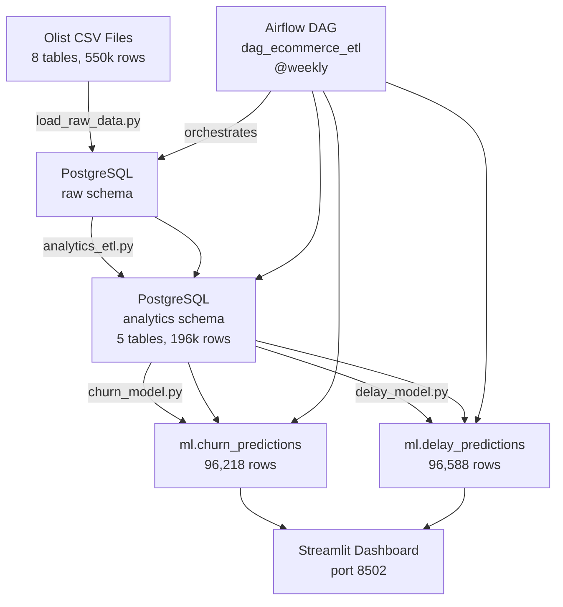

# 📅 DAY 48 — Sprint 07 | Final Demo + README + Sprint Close
## Capstone Documentation, Architecture Diagram, Portfolio README

---

## 🔁 RETROSPECTIVE — Day 47

### Instructor Assessment
| Item | Result | Note |
|------|--------|------|
| Overview page | ✅ Pass | $16M revenue, all KPIs correct |
| Orders page | ⚠️ Fix | 96580.00 → 96,580 (format as int) |
| Customers page | ✅ Pass | 3% repeat rate, $167 LTV |
| Sellers page | ✅ Pass | 3,095 sellers, 85.28% on-time |
| ML Insights 3-tab | ✅ Pass | Churn + delay histograms |
| Delay predicted rate 51.9% | ⚠️ Note | Document as model limitation |

### Pre-Start
```bash
cd C:\90_day_python_de_plan

# Fix 1: Orders page integer formatting
# In capstone/dashboard/pages/orders.py
# col1.metric("Total Orders", f"{len(filtered):,}")   ← add comma format

# Fix 2: Add delay model limitation note to ml_insights.py
# See Day 47 instructions above

git checkout develop
git pull origin develop
git checkout -b sprint-07/day-48-final-demo
```

---

## 🗂️ JIRA CARD

| Field           | Value |
|-----------------|-------|
| Epic            | EP-10: Capstone & Job Readiness |
| Story           | ST-48: Final Demo + Documentation |
| Task ID         | TASK-048 |
| Sprint          | Sprint 07 (Days 43–48) |
| Story Points    | 3 |
| Priority        | CRITICAL |
| Labels          | readme, architecture, demo, portfolio, day-48 |
| Acceptance Criteria | README.md portfolio-ready; ARCHITECTURE.md complete; sprint-07-complete tag; all 7 sprint tags present |

---

## 🎯 OBJECTIVES

1. Fix Orders page formatting + delay model note
2. Write `capstone/README.md` — portfolio document
3. Complete `capstone/docs/ARCHITECTURE.md` — with Mermaid diagram
4. Write `capstone/docs/DATA_QUALITY.md` — known issues + decisions
5. Close Sprint 07 + create `sprint-07-complete` tag
6. Run the full system end-to-end as a final demo

---

## ⏱️ TIME BUDGET (2 hrs)

| Block | Duration | Activity |
|-------|----------|----------|
| A | 15 min | Fix formatting issues |
| B | 45 min | capstone/README.md |
| C | 25 min | ARCHITECTURE.md + Mermaid diagram |
| D | 15 min | DATA_QUALITY.md |
| E | 20 min | Final demo run + sprint close |

---

## 📝 EXERCISES

---

### EXERCISE 1 — capstone/README.md (Block B)

This is the document a recruiter or hiring manager reads. Write it as if explaining the project to a senior engineer who has 5 minutes.

Create `capstone/README.md`:

```markdown
# E-Commerce Analytics Platform
### Python Data Engineering Capstone — 90-Day DE Journey

End-to-end analytics platform built on 100,000 real Brazilian e-commerce orders
(Olist dataset, 2016-2018). Demonstrates the full DE stack: ETL pipelines →
SQL transforms → ML models → Airflow orchestration → Streamlit dashboard.

---

## 🚀 Quick Start

### Prerequisites
- Python 3.12, PostgreSQL 17
- Virtual environment activated
- `.env` configured (see `.env.example`)

### Run the Dashboard
```bash
cd C:\90_day_python_de_plan
capstone\dashboard\run_dashboard.bat
# Opens: http://localhost:8502
```

### Run the Full Pipeline
```bash
# Manual trigger (or @weekly via Airflow)
# In WSL2:
airflow dags trigger dag_ecommerce_etl
```

---

## 📊 Dashboard Pages

| Page | Key Metrics | Tech |
|------|------------|------|
| Overview | $16M revenue, 96k customers, 4.15⭐ avg review | Plotly, Streamlit |
| Orders | 8.11% late rate, delivery time analysis | Plotly histogram + box |
| Customers | 3% repeat rate, $167 avg LTV, churn risk | Plotly scatter |
| Sellers | 3,095 sellers, 85.28% on-time rate | Plotly scatter + table |
| ML Insights | Churn predictions, delay probability | Plotly histogram |

---

## 🏗️ Architecture

```
Raw CSVs (Kaggle Olist)
    │   8 tables, 550k rows
    ▼
PostgreSQL — raw schema
    │   load_raw_data.py
    ▼
PostgreSQL — analytics schema         ← analytics_etl.py
    ├── customer_ltv      96,218 rows
    ├── order_metrics     96,588 rows
    ├── seller_performance 3,095 rows
    ├── product_analytics     71 rows
    └── monthly_revenue       22 rows
    │
    ├── churn_model.py  → ml.churn_predictions (96,218 rows)
    └── delay_model.py  → ml.delay_predictions (96,588 rows)
    │
    ▼
Airflow DAG: dag_ecommerce_etl (@weekly)
    │   run_analytics_etl → [run_churn_model ‖ run_delay_model] → log_pipeline_run
    ▼
Streamlit Dashboard (port 8502)
    └── 5 pages with live PostgreSQL data
```

---

## 📁 Project Structure

```
capstone/
├── data/raw/           ← Olist CSV files (not committed — 150MB)
├── etl/
│   ├── load_raw_data.py   ← CSV → PostgreSQL raw schema
│   └── analytics_etl.py   ← raw → 5 analytics tables
├── ml/
│   ├── churn_model.py     ← Customer churn prediction
│   ├── delay_model.py     ← Delivery delay prediction
│   └── models/            ← Saved pipelines (.pkl)
├── dashboard/
│   ├── app.py             ← Streamlit entry point
│   ├── db.py              ← Cached query functions
│   └── pages/             ← 5 dashboard pages
└── docs/
    ├── ARCHITECTURE.md    ← System design
    └── DATA_QUALITY.md    ← Known issues
```

---

## 🤖 ML Models

| Model | Target | Algorithm | CV F1 | Notes |
|-------|--------|-----------|-------|-------|
| Churn | Single-purchase customer | RF + SMOTE | ~0.22 | Limited by feature availability; total_orders excluded (leakage) |
| Delay | Order delivered late | RF + SMOTE | ~0.15 | Weak features; seller history would improve significantly |

Both models use `imbalanced-learn` ImbPipeline (SMOTE → StandardScaler → RandomForest)
and are saved as single `.pkl` artifacts for reproducible inference.

---

## 🔑 Key Business Findings

1. **Late deliveries cost 1.72 review points**: On-time = 4.29⭐, Late = 2.57⭐
2. **97% of customers buy only once**: Typical marketplace behaviour; retention is the core business challenge
3. **8.11% of orders are late**: 7,837 orders affected; concentrated in specific seller-state combinations
4. **Top category**: [fill in from your product_analytics query]
5. **Best sellers**: 85.28% average on-time rate; high variance between top and bottom performers

---

## 🛠️ Tech Stack

| Layer | Technology |
|-------|-----------|
| Database | PostgreSQL 17 |
| ETL | Python, pandas, SQLAlchemy |
| Orchestration | Apache Airflow 2.9.3 (WSL2) |
| ML | scikit-learn, imbalanced-learn |
| Visualisation | Plotly, Streamlit |
| Version Control | Git (GitHub) |

---

## 📝 Data Source

Olist Brazilian E-Commerce Public Dataset  
https://www.kaggle.com/datasets/olistbr/brazilian-ecommerce  
License: CC BY-NC-SA 4.0
```

---

### EXERCISE 2 — ARCHITECTURE.md with Mermaid (Block C)

Complete `capstone/docs/ARCHITECTURE.md` with a Mermaid pipeline diagram:

```markdown
# System Architecture

## Pipeline Flow



## Database Schema

### raw schema (source data — no transforms)
[Add table list from Day 43]

### analytics schema (business metrics)
[Add table definitions from Day 44]

### ml schema (model outputs)
[Add prediction table definitions from Day 45]

## Design Decisions

| Decision | Choice | Rationale |
|----------|--------|-----------|
| Schema separation | raw/analytics/ml | Clean lineage — each layer has one purpose |
| Payment aggregation | SUM before JOIN | raw.order_payments has multiple rows per order |
| Churn definition | single-purchase = churned | Dataset ends 2018 — time-based definition unreliable |
| Model persistence | ImbPipeline pkl | Scaler + SMOTE config travels with model |
| Airflow schedule | @weekly | Static dataset — daily refresh adds no value |
```

---

### EXERCISE 3 — DATA_QUALITY.md (Block D)
**[Write yourself — document what you found]**

Create `capstone/docs/DATA_QUALITY.md`:

```markdown
# Data Quality Findings

## Known Issues

| Issue | Table | Impact | Resolution |
|-------|-------|--------|------------|
| Multiple rows per order_id | raw.order_payments | Double-counting revenue | GROUP BY + SUM before JOIN |
| NULL delivery dates | raw.orders | ~3k undelivered orders | Filter WHERE status='delivered' |
| Portuguese category names | raw.products | Unreadable in reports | JOIN to product_category_translation |
| is_churned=100% with time-based definition | analytics.customer_ltv | Unusable for ML | Redefined as single-purchase |
| delay_pipeline overestimates late rate | ml.delay_predictions | 52% vs actual 8% | Weak features; model limitation documented |
| monthly_revenue has 22 not 24 months | analytics.monthly_revenue | Minor | Boundary months incomplete |

## Column Notes
- review_comment_message: contains raw HTML — not cleaned (not used in analytics)
- order_approved_at: ~160 NULLs (orders not approved) — excluded from delivery calc
- product_weight_g: ~600 NULLs — imputed with category median in future work

## Churn Definition Decision
Single-purchase definition chosen over time-based because:
  - Dataset ends Aug 2018 — all customers appear inactive from today's date
  - Single-purchase is objective and consistent with Olist's known 97% one-time buyer rate
  - Industry benchmark: 95-97% single purchase is normal for Brazilian e-commerce (2017-2018)
```

---

### EXERCISE 4 — Final Demo Run (Block E)

```bash
# Full system smoke test — run everything from scratch

# 1. ETL
python capstone/etl/analytics_etl.py 2>&1 | tail -5

# 2. ML
python capstone/ml/churn_model.py 2>&1 | grep "CV F1\|Predictions written"
python capstone/ml/delay_model.py 2>&1 | grep "CV F1\|predictions"

# 3. Dashboard
streamlit run capstone/dashboard/app.py --server.port 8502 --server.headless true &
sleep 5
curl -s http://localhost:8502 | grep -c "Streamlit"
pkill -f "capstone/dashboard" 2>/dev/null

echo "All systems go ✅"
```

---

### EXERCISE 5 — Sprint Close

```bash
# Commit Day 48
python scripts/daily_commit.py --day 48 --sprint 7 ^
    --message "Capstone complete: README, ARCHITECTURE.md, DATA_QUALITY.md, orders format fix, sprint close"^
    --merge

# Close Sprint 07
python scripts/daily_commit.py --day 48 --sprint 7 ^
    --message "Sprint 07 complete" ^
    --to-main

# Verify
git tag
# sprint-01-complete through sprint-07-complete
```

---

## ✅ DAY 48 COMPLETION CHECKLIST

| # | Task | Done? |
|---|------|-------|
| 1 | Orders page: integer format fixed | [ ] |
| 2 | Delay model limitation note added to ml_insights.py | [ ] |
| 3 | `capstone/README.md` written — portfolio-ready | [ ] |
| 4 | `capstone/docs/ARCHITECTURE.md` complete with Mermaid diagram | [ ] |
| 5 | `capstone/docs/DATA_QUALITY.md` complete | [ ] |
| 6 | Full system smoke test passes | [ ] |
| 7 | `sprint-07-complete` tag created | [ ] |
| 8 | All 7 sprint tags visible in `git tag` | [ ] |

---

## 🔍 WHAT YOU'VE BUILT IN 48 DAYS

```
Sprint 01  Python setup + PostgreSQL + ETL foundations
Sprint 02  Production ETL with retry, resilience, OOP
Sprint 03  Type hints, ORM, pandas analytics, pytest coverage
Sprint 04  Airflow: 10+ DAGs, pools, datasets, callbacks
Sprint 05  Visualization: matplotlib, Plotly, Streamlit (4 pages)
Sprint 06  ML: LR → RF → SMOTE → KMeans → Airflow ML pipeline
Sprint 07  Capstone: 550k rows, 5 analytics tables, 2 ML models,
           Airflow orchestration, 5-page Streamlit dashboard

Recruiter pitch:
"I built an end-to-end data platform on 100k real e-commerce orders:
 ETL from Kaggle CSVs into PostgreSQL via Airflow, SQL analytics
 transforming raw data into business metrics, ML models for churn and
 delivery prediction using scikit-learn and imbalanced-learn, and a
 live Streamlit dashboard. The whole pipeline runs automatically on a
 weekly schedule."
```

---

## 🔜 WHAT'S NEXT (Days 49–90)

```
Sprint 08  Advanced SQL: window functions, CTEs, query optimisation
Sprint 09  dbt: data modelling, testing, documentation
Sprint 10  Cloud: AWS S3 + RDS or GCP BigQuery
Sprint 11  Data quality: Great Expectations
Sprint 12  Portfolio polish + interview prep
```

The hardest sprints are done. The remaining sprints build depth on tools that use the same foundations you've already mastered.

---

*Day 48 | Sprint 07 | EP-10 | TASK-048 — Capstone Complete*
